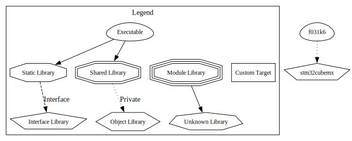

# stm_cpp
This project builds a hardware abstraction layer (HAL) entirely in modern C++ (using C++-17).
Care it taken to make "NO ASSEMBLY" startup code.
Only the vector table is in the ".c" format.

## Target
The board used in this project is [STM32F031K6](https://www.st.com/en/microcontrollers-microprocessors/stm32f031k6.html) based [Nucleo](https://www.st.com/en/evaluation-tools/nucleo-f031k6.html) board.

## Tools
The project is based on following tools:
* `cmake` + `ninja` (use latest version)
* ARM LLVM Clang compiler
  * located in home folder, see `CMakePresets.json`.
* `graphviz` for generating images
* `STM32CubeMx` Graphical hardware configurator for STM32 devices.

## CMake Graphwiz
The following graph shows the various dependencies

## How to...
### Preparation
Generate a simple GPIO toggle LED project for the Nucleo Board using `STM32CubeMx`.
### Follow the main...
Use the main for the LED and construct memory mapped classes for devices and registers. More information [here](https://youtu.be/uwzuAGtAEFk?si=EDgB50rwYIla1Tlj).